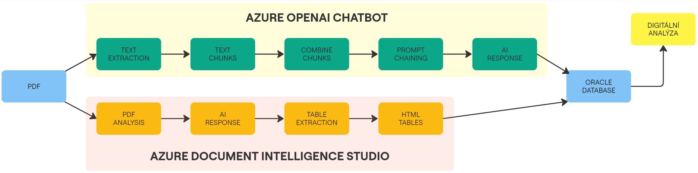

# Applying AI for Text Extraction from Documents and Its Integration into a Credit Analysis Application
# Introduciton

A flowchart representing the process:



The process represented by a pseudocode:

```plaintext
utils.py

|-- Load Environment Variables
|
|-- Initialize AzureChatOpenAI Client
|-- Initialize DocumentIntelligence Client
|
|-- Define Functions:
|   |-- extract_text_from_pdf
|   |-- get_pdf_files
|   |-- extract_table_data_from_pdf
|   |-- database
```
```plaintext 
main.py

Start
|
|-- Import Functions from utils.py
|
|-- Get PDF Files from Directory
|
|-- For Each PDF File:
|   |-- Extract Text from PDF
|   |-- Combine Text Chunks
|   |
|   |-- For Each Question:
|   |   |-- Formulate Context and Question
|   |   |-- Get Response from Azure OpenAI
|   |   |-- Store Response
|   |
|   |-- Extract Table Data from PDF
|   |-- Update Responses into Database
|
End
```